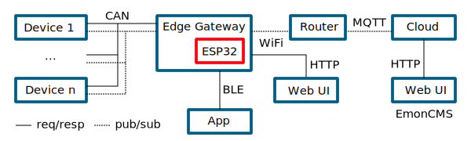
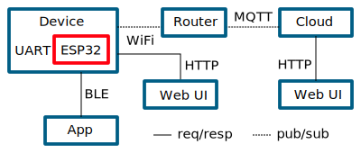

# Libre Solar Data Manager Firmware

Firmware for CAN and UART to WiFi or Bluetooth gateway based on ESP32-IDF v4.0.

**Warning:** This firmware is at a very early stage. Expect bugs and report them in the issues :)

## Concept Overview

The firmware should support multiple use-cases to connect Libre Solar devices with other networks (incl. the internet).

### ESP32 acting as an Edge Gateway to the cloud

In this application, the ESP32 is integrated in a separate device (like the Libre Solar [Data Manager](https://github.com/LibreSolar/data-manager)) and communicates with the other devices like the charge controller via CAN bus.

The ThingSet protocol on the CAN bus can translated to MQTT in order to push data to a cloud. For local access, the ESP32 can directly serve a website or provide a Bluetooth Low Energy interface for a mobile phone app.



### ESP32 integrated in device (e.g. charge controller)

The ESP32 board can also be directly integrated in a charge controller or other devices and communicate with the host device via UART interface (again using the ThingSet protocol).

The data can be accessed in the same way as described above.



## Supported devices

- Libre Solar [Data Manager](https://github.com/LibreSolar/data-manager)
- Sparkfun ESP32thing
- Most other ESP32-based boards

## Firmware features

- Written in C using ESP-IDF and PlatformIO
- Data input from Libre Solar devices via
    - [LS.bus](https://libre.solar/docs/ls_bus/) (CAN bus)
    - [LS.one](https://libre.solar/docs/ls_one/) (UART serial)
- Local communication via [ThingSet Protocol](http://libre.solar/thingset/)
- Data access via HTTP JSON API
- Publishing of monitoring data via WiFi to
    - Open Energy Monitor [Emoncms](https://emoncms.org/)
    - MQTT sever (ToDo)
- Data logging on SD card (ToDo)

## Usage

### Build the Webapp

To be able to build the data-manager-firmware you need to build the webapp first.
To do so, go into the webapp folder

```
    cd data-manager-firmware/webapp
```
and run

```
    npm install
    npm run build
```
you are now able to build the firmware itself.

### ESP-IDF toolchain

The ESP-IDF is the native toolchain for ESP32 microcontrollers by Espressif. Follow [this guide](https://docs.espressif.com/projects/esp-idf/en/latest/get-started/index.html#) to install it.

After installation run the following commands:

    idf.py build            # compile the firmware
    idf.py flash            # flash it to the device

### PlatformIO

You can use PlatformIO for easy bulding and flashing. Currently, ESP-IDF 4.0 support is still in beta phase, so it might not work out of the box. However, the setup in `platformio.ini` was adjusted to support the new ESP-IDF already.

### Configuration

The firmware is configured using Kconfig integrated into ESP-IDF.

The most convenient way is to run `idf.py menuconfig` after the ESP-IDF was successfully installed. If ESP-IDF is not available and PlatformIO is used, configuration can be changed manually in the generated `sdkconfig` file.

WiFi credentials are currently hard-coded and are also set as Kconfig parameters.
